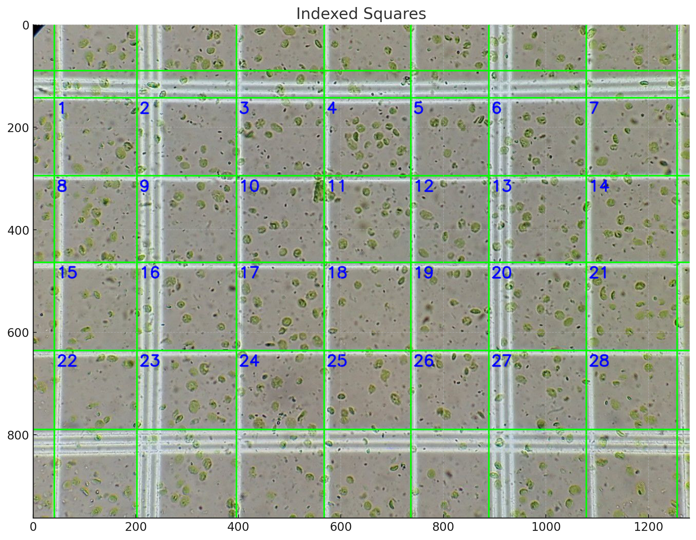

# Green Cell Detection in Grid Squares

This project provides a Python-based approach to detect and count green cells within grid squares of an image. Utilizing the powerful OpenCV library, various image processing tasks such as edge detection, line detection, and color-based segmentation are performed.

## Table of Contents

- [Introduction](#introduction)
- [Installation](#installation)
- [Usage](#usage)
- [Functions](#functions)
- [Examples](#examples)
- [Contributing](#contributing)
- [License](#license)

## Introduction

This project demonstrates how to process an image to detect green cells within grid squares. The approach includes:
- Loading and converting images
- Detecting edges and lines
- Merging nearby lines
- Indexing and cropping grid squares
- Detecting green cells within each square
- Displaying results with annotated images

## Installation

To get started with this project, clone the repository and install the required dependencies.

```bash
git clone https://github.com/takanukisatoshi/green-cell-detection.git
cd green-cell-detection
pip install -r requirements.txt
```

## Usage

To run the script, use the following command:

```bash
python detect_green_cells.py --image_path path/to/your/image.jpg --num_squares all --min_area_threshold 100
```

### Arguments

- `--image_path`: Path to the input image (required).
- `--num_squares`: Number of squares to process (default: `'all'`).
- `--min_area_threshold`: Minimum area threshold for detecting green cells (default: `100`).

## Functions

### `load_and_convert_image(image_path)`

Loads and converts an image to grayscale.

### `detect_edges(gray_image, threshold1=50, threshold2=150)`

Detects edges in a grayscale image using the Canny algorithm.

### `detect_lines(edges, threshold=100, min_line_length=100, max_line_gap=10)`

Detects lines in an edge-detected image using the Hough Line Transform.

### `merge_nearest_lines(lines, image, threshold=50)`

Merges nearby lines to reduce redundancy.

### `index_and_crop_squares(image, horizontal_lines, vertical_lines)`

Indexes and crops squares based on detected and merged lines.

### `detect_green_cells(image, min_area_threshold=100)`

Detects green cells in an image and filters them based on area.

### `index_squares(image, horizontal_lines, vertical_lines)`

Indexes squares on the image.

### `process_and_display_images(image_path, num_squares='all', min_area_threshold=100)`

Processes the image, detects edges and lines, merges lines, indexes and crops squares, detects green cells, and displays the results.

## Examples

### Original, Edges, Detected Lines & Merged Lines


### Indexed Squares


### Sample Cropped Squares


### Detected Green Cells


## Contributing

Special Thank to 
- Master Huy Nguyen Tien Anh - Ho Chi Minh City - University of Sciences 

Contributions are welcome! Please follow these steps to contribute:

1. Fork the repository.
2. Create a new branch (`git checkout -b feature/your-feature-name`).
3. Commit your changes (`git commit -m 'Add some feature'`).
4. Push to the branch (`git push origin feature/your-feature-name`).
5. Open a Pull Request.

## License

This project is licensed under the MIT License. See the [LICENSE](LICENSE) file for details.
