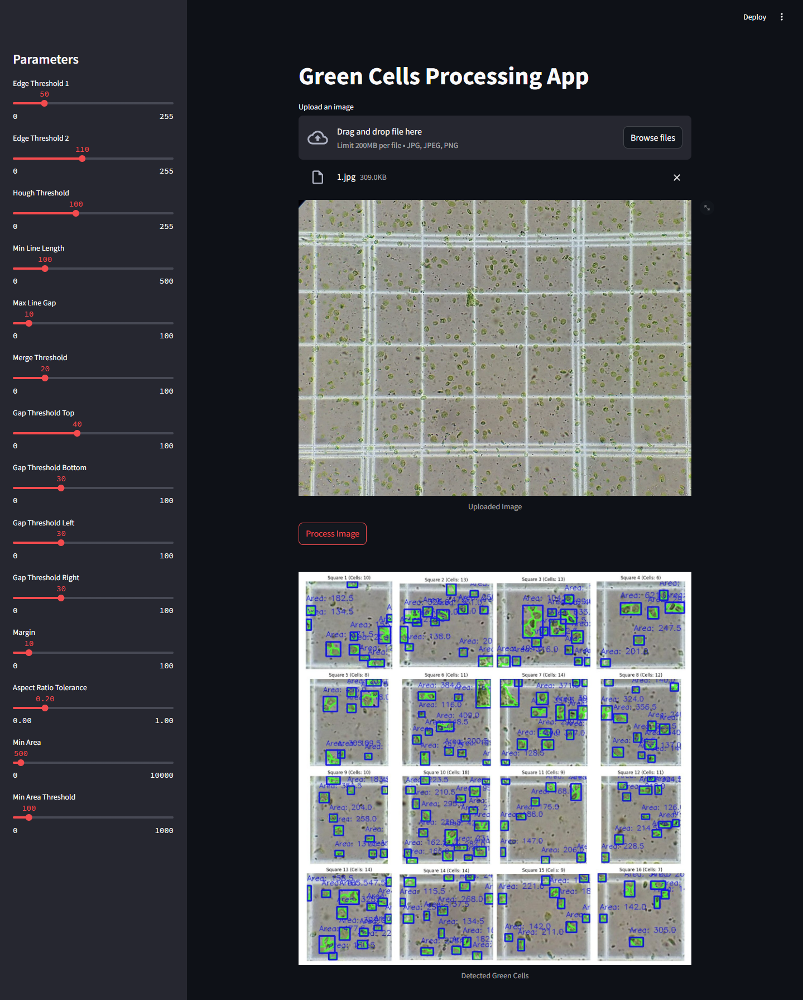
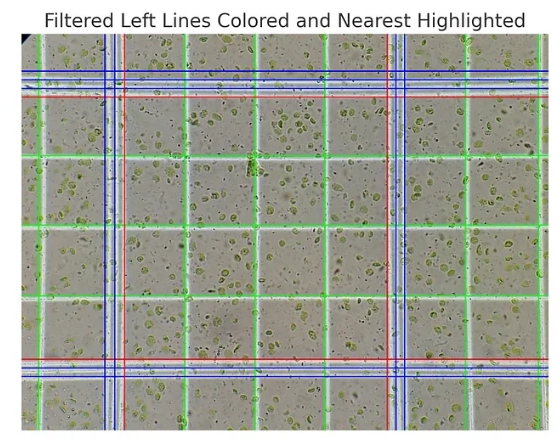
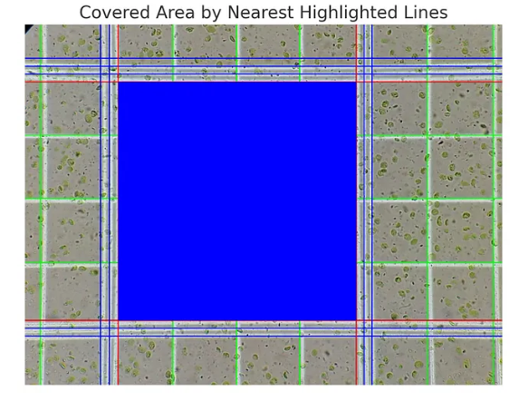
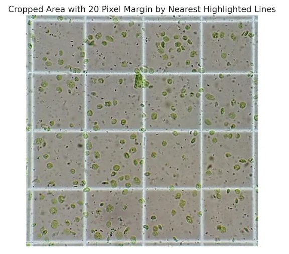
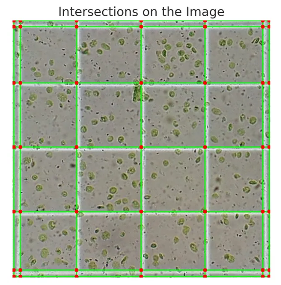
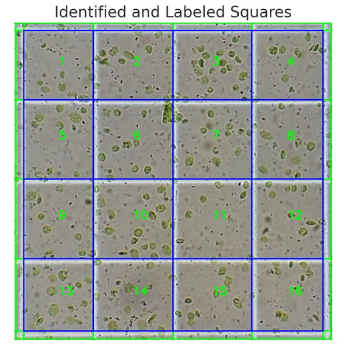
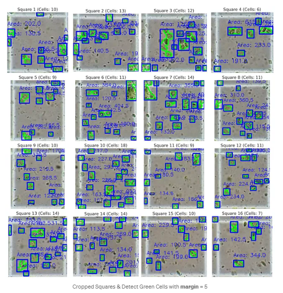

# Green Cell Detection in Grid Squares

Cells Detector is a Python-based application designed to detect and process plant cells in images. This tool leverages OpenCV and matplotlib for image processing, including edge and line detection, and cropping based on detected lines. It is built to run from the command line with customizable processing thresholds.

## Medium Post:

[Detecting Green Cells in Grid Squares: A Step-by-Step Guide with OpenCV and Python (Part 1)](https://medium.com/@katanuki/analyzing-and-processing-grid-images-with-opencv-part-1-d5c42ab0703c)

[Detecting Green Cells in Grid Squares: A Step-by-Step Guide with OpenCV and Python (Part 2)](https://medium.com/@katanuki/analyzing-and-processing-grid-images-with-opencv-part-2-31408b5671a6)

[Detecting Green Cells in Grid Squares: A Step-by-Step Guide with OpenCV and Python (Part 3)](https://medium.com/@katanuki/detecting-green-cells-in-grid-squares-a-step-by-step-guide-with-opencv-and-python-part-3-9a22979846d4)

[Detecting Green Cells in Grid Squares: A Step-by-Step Guide with OpenCV and Python (Part 4)](https://medium.com/@katanuki/detecting-green-cells-in-grid-squares-a-step-by-step-guide-with-opencv-and-python-end-c7c75714219f)

## Table of Contents

- [Introduction](#introduction)
- [Usage](#usage)
- [Contributing](#contributing)
- [License](#license)

## Introduction

This project demonstrates how to process an image to detect green cells within grid squares. The approach includes:

- **Edge Detection**: Identify edges in images using various edge detection algorithms.
- **Line Detection**: Detect horizontal and vertical lines in images.
- **Line Merging and Filtering**: Merge and filter lines based on specific criteria.
- **Intersection Finding**: Identify intersections of horizontal and vertical lines.
- **Square Processing**: Identify squares formed by intersecting lines and label them.
- **Image Cropping**: Crop images based on detected lines and save the results.
- **Dectect Green Cells**: Detecting green cells within each square.

## Prerequisites

Ensure you have Python installed on your system. This project requires Python 3.8 or newer.

## Setting Up a Virtual Environment

To get started with this project, clone the repository and install the required dependencies.

```bash
git clone https://github.com/katanukisatoshi/cells_detector.git
cd cells_detector
```

It's recommended to use a virtual environment to manage the dependencies for your project. You can set up a virtual environment using the following commands:

```bash
# Install virtualenv if it's not already installed
pip install virtualenv

# Create a virtual environment
virtualenv venv

# Activate the virtual environment
# On Windows
venv\Scripts\activate
# On Unix or MacOS
source venv/bin/activate
```

## Installing Dependencies

Once your virtual environment is active, you can install the required dependencies by running:

```bash
pip install -r requirements.txt
```

## Usage

### Running the Cells Detector

#### Run the application

To run the crop area detection and then detect green cells in all cropped squares, use the `main.py` script with the desired options:

```sh
python main.py --input_path data/test/1.jpg
```

This will process the image `1.jpg` in the `data/test/` directory, detect edges and lines, identify intersections, crop the image, and then detect cells in the cropped image saved in the `data/cropped/` directory. You can check the cropped image manually. The results of green cells detector will be saved in the `data/output/`

##### Command Line Arguments

- `--image_path`: Path to the input image file.
- `--output_path`: Directory to save the cropped images.
- `--edge_threshold1`: First threshold for the hysteresis procedure in edge detection (optional).
- `--edge_threshold2`: Second threshold for the hysteresis procedure in edge detection (optional).
- `--hough_threshold`: Threshold for the Hough Line Transform (optional).
- `--min_line_length`: Minimum length of a line (optional).
- `--max_line_gap`: Maximum allowed gap between line segments to treat them as a single line (optional).
- `--margin`: Margin for cell detection (optional).
- `--aspect_ratio_tolerance`: Tolerance for the aspect ratio of detected cells (optional).
- `--min_area`: Minimum area for detected cells (optional).
- `--min_area_threshold`: Minimum area threshold for detected cells (optional).
- Other optional parameters are also available for fine-tuning the process.

### Streamlit Interface

Mention how users can run the Streamlit interface and what to expect from it:

Run the streamlit UI:

   ```sh
   streamlit run user_interface.py
   ```
   
This command will launch a web interface where users can upload an image, adjust parameters, and view the results interactively.



## Examples

### Detected Lines & Merged Lines


### Detected Potential Area


### Cropped Potential Area


### Detected Lines and Intersections


### Detected Squares and Indexing


### Detected Green Cells on Squares


## Contributing

Special Thank to
- Master Huy Nguyen Tien Anh - Ho Chi Minh City - University of Sciences 
- Minh Hoan - Fullstack Senior Developer
  
Contributions are welcome! Please follow these steps to contribute:

1. Fork the repository.
2. Create a new branch (`git checkout -b feature/your-feature-name`).
3. Commit your changes (`git commit -m 'Add some feature'`).
4. Push to the branch (`git push origin feature/your-feature-name`).
5. Open a Pull Request.

## License

This project is licensed under the MIT License. See the [LICENSE](LICENSE) file for details.
